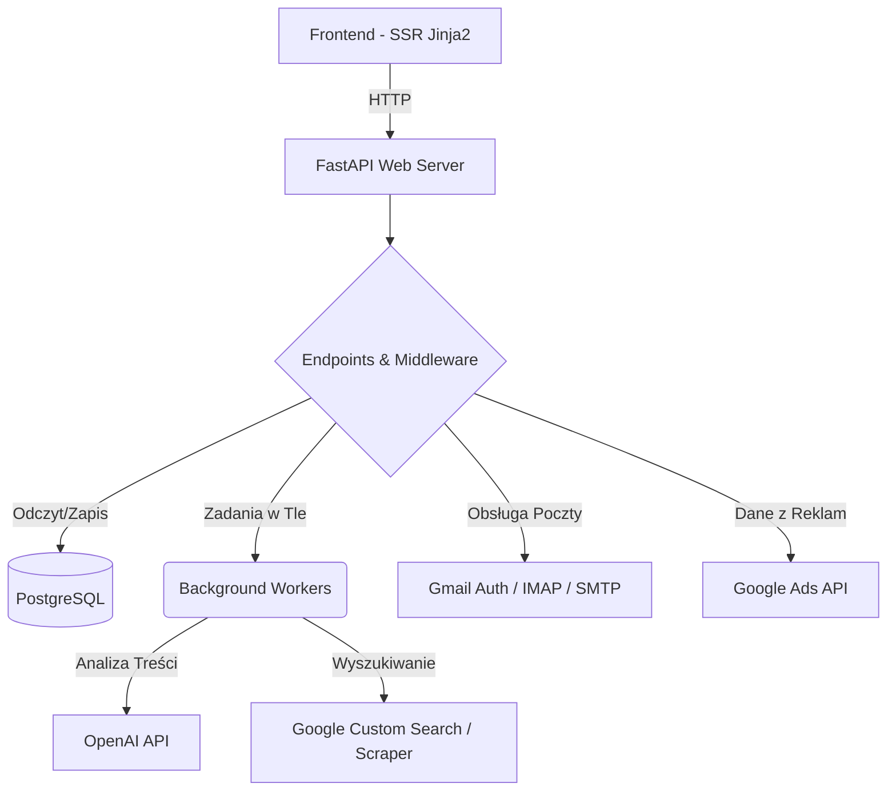

# ENIOS CRM

> **Informacja**  
> To repozytorium pełni funkcję poglądową (portfolio). Ze względów prywatności kod źródłowy tego projektu nie jest publicznie dostępny. Poniżej znajduje się architektura, opis funkcji oraz stos technologiczny wykorzystany do budowy aplikacji.

## 📖 O projekcie

**ENIOS CRM** to aplikacja webowa napisana w języku Python. Projekt powstał z myślą o pomocy w prowadzeniu niewielkiej firmy mojego przyjaciela, tworząc dla niej centralne środowisko automatyzacji, usprawniające zarządzanie bazą kontaktów, obsługę e-maili i planowanie zautomatyzowanych kampanii. Całość zintegrowano z modelami AI (OpenAI), aby przyspieszyć proces analizy korespondencji i generowania roboczych szkiców odpowiedzi.

## 🚀 Główne funkcje

- ✉️ **Agregator Poczty (Gmail API & IMAP/SMTP):** Synchronizacja skrzynek pocztowych. Aplikacja pobiera i grupuje przychodzące i wychodzące wiadomości w przypisaniu do odpowiednich kontaktów w bazie.
- 🤖 **Integracja z OpenAI (GPT-4o-mini):** Skrypt analizujący wątki wiadomości. Klasyfikuje ewentualne zaangażowanie po stronie nadawcy i generuje wariant "follow-upu" w celu ułatwienia dalszej konwersacji.
- 📧 **Moduł Kampanii E-mail:** System wysyłki wiadomości obsługujący proste szablony, ustalone dzienne limity wysyłania (daily limits) i odstępy czasowe między wiadomościami. Odbiera i zapisuje podstawowe zdarzenia, takie jak liczba otwarć i kliknięć.
- 📊 **Panel informacyjny Google Ads:** Wyświetlanie logów dla kont reklamowych za pomocą oficjalnego API Google. Umożliwia wgląd w podstawową strukturę kampanii i wyświetlenie podsumowania metryk (wyświetlenia, kliknięcia, konwersje).
- 🔍 **Parser Wyszukiwarki / Scraper:** Asynchroniczny skrypt wyszukujący profile lub organizacje w serwisie Google (Custom Search) pod kątem podanego słowa kluczowego. Automatycznie analizuje zwrócone wyniki w celu zapisywania adresów e-mail powiązanych ze stronami.

## 🛠 Wykorzystane technologie

Aplikacja stanowi klasyczny asynchroniczny backend w Pythonie bazujący na relacyjnej bazie danych:

- **Backend:** Python 3.12, FastAPI, Uvicorn, renderowanie stron po stronie serwera za pomocą biblioteki Jinja2.
- **Baza Danych:** PostgreSQL operujący na sterowniku `asyncpg` i bibliotece optymalizacyjnej SQLAlchemy 2.0.
- **Integracje Zewnętrznych API:** API od OpenAI, pakiety Google do uwierzytelniania `OAuth2` (Ads API, Gmail API, Custom Search Engine).
- **Sieć / Rozszerzenia:** `aiohttp` oraz `BeautifulSoup` do obsługi zgłoszeń asynchronicznych i przeszukiwania tagów HTML; `cryptography / Fernet` do lokalnego uwierzytelniania i bezpiecznego wpisywania wierszy powiązanych z hasłami SMTP.

## 📐 Architektura Systemu

Procesy podzielone są według domózpiecznych standardów, pozwalając na separację poszczególnych modułów funkcjonalnych:

- **Punkt wejścia (Routing):** Zlokalizowane endpointy serwują w formacie asynchronicznym zapytania lub zwroty HTML do przeglądarki klienta korzystając z mechanizmu "Singleflight Pattern/Caching", co ocala przed zużywaniem zewnętrznych i narzucanych limitów żądań.
- **Background Tasks:** Skrypty pracujące częściowo w tle - parser na bazie `aiohttp`, sprawdzający AI worker dla wątków i powiązane skrypty do analiz kampanii. Zapisują dane prosto z pominięciem blokady wejścia użytkownika.
- **ORM Database:** Asynchroniczne połącznia wykorzystujące wyczerpujące zapytania z pomocą zapytań DDL. Obsługują relacyjne połącznia i integralność e-mali bez duplikatów.

## 💼 Historia i cel projektu
Projekt został stworzony dla mojego dobrego przyjaciela, który rozwija własną, niewielką firmę. Celem aplikacji było odciążenie go z codziennej, monotonnej rutyny i trudów bycia początkującym przedsiębiorcą. 

Na wczesnym etapie biznesu rzadko dysponuje się wolnymi środkami na opłacanie bardzo drogich, komercyjnych systemów (oferujących często takie same funkcje). Dlatego napisałem dla niego ten uproszczony, spersonalizowany webowy Dashboard, który gromadzi niezbędne w firmie narzędzia w jednym miejscu:

1. **Pozyskiwanie kontaktów:** Zredukowanie uciążliwego, ręcznego szukania klientów w Google. Proces ten zautomatyzowano darmowym wbudowanym asynchronicznym "Scraperem".
2. **Kontrola kosztów:** Szybszy i znacznie przyjaźniejszy sposób śledzenia skuteczności reklam za sprawą importu danych pod własny interfejs, pomijający skomplikowany portal Google Ads.
3. **Mailing z pomocą AI:** Ogromna oszczędność cennego czasu trwonionego przy opisywaniu klientom. Zamiast wgłębiania się w gąszcz historycznej korespondencji, sztuczna inteligencja bada każdy nierozwiązany wątek i z miejsca sugeruje gotowego maila (follow-up).

